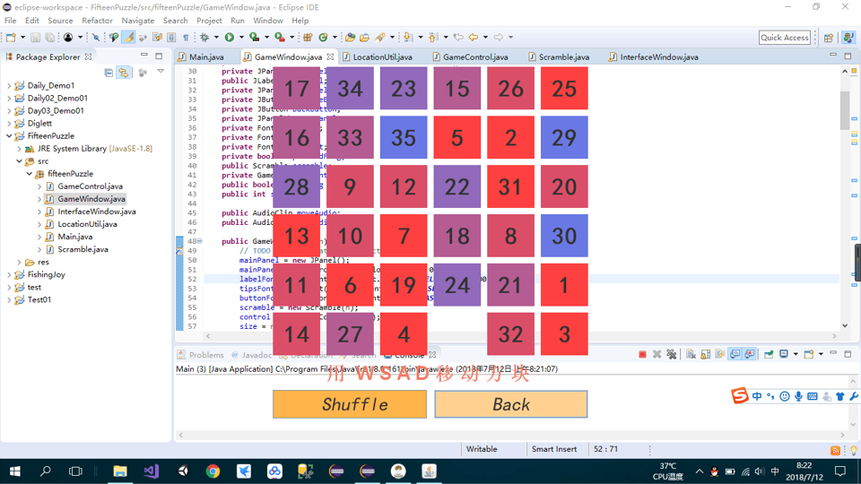

### FifteenPuzzle-Java
#### 游戏名：数字华容道

 

    
     
    
图1 开始菜单

 

    
     
    
图2 简单难度

 

    
     
    
图3 一般难度

 

    
     
    
图4 困难难度

 

    
     
    
图5 地狱难度

 

    
     
    
图6 通关画面

 

    
     
    
图7 统计步数

 

